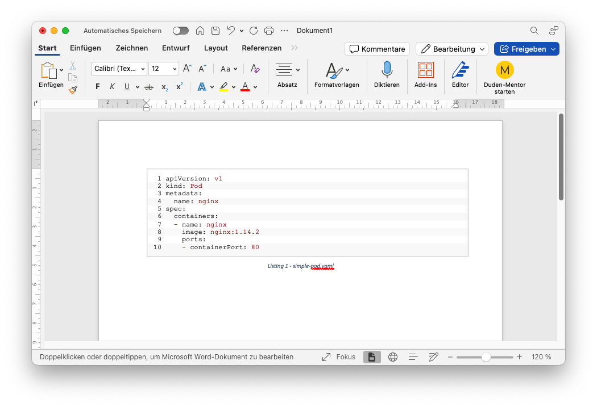

# code-styling

Hosted on GitHub Pages: https://lucasg04.github.io/code-styling/

## How to use

1. Format your code using any other formatter
2. Copy the code into the textarea
3. Click "Copy"
4. Select the code from the output and copy it
5. Two approaches for word:
   1. Paste it to your word document and select "Keep Source Formatting" from the paste menu
   1. Go to "Insert" tab, "Text" section, click "Object" (it's on the right), Choose "Microsoft Word Document", paste your code into the new document and select "Keep Source Formatting" from the paste menu, Save and Close the new document

## Third party deps

- [highlight.js](https://highlightjs.org/) for highlighting the code

## Example

  

